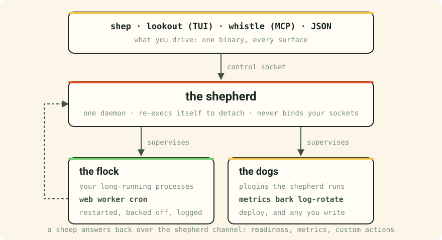

<div align="center">

<picture>
  <source media="(prefers-color-scheme: dark)" srcset="assets/banner-dark.svg">
  
</picture>

<p>
<a href="https://crates.io/crates/shep"></a>
<a href="https://crates.io/crates/shep"></a>
<a href="https://github.com/shep-pm/shep/actions/workflows/test.yml"></a>
<a href="https://shep-pm.com/docs"></a>
<a href="https://github.com/shep-pm/shep#license"></a>
</p>

</div>

One binary runs a daemon called the shepherd. It restarts your processes when
they die, captures what they print, and says plainly when something is wrong.
Same feature list as pm2. Different opinions about what a supervisor owes you
at 3am.

```bash
cargo install shep          # or: brew install shep-pm/shep/shep
shep welcome                # the tour, in your own terminal
```


Every command answers with the whole flock, not just the sheep you touched.
The face in the STATUS column is the fastest thing on the page to read:
`(o.o)` online, `(o~o)` starting, `(>_<)` waiting to restart, `(-.-)` stopped,
`(x.x)` errored.

## What's in the fold

| Repo | What it is |
| :-- | :-- |
| **[shep](https://github.com/shep-pm/shep)** | The process manager. Daemon, CLI, `lookout` (TUI), `whistle` (MCP server), and the client crates your app links against. |
| **[shep-deploy](https://github.com/shep-pm/shep-deploy)** | A deploy dog. Watches a branch, builds a release, swaps to it, rolls back if it does not come up. |
| **[shep-discord](https://github.com/shep-pm/shep-discord)** | A Discord dog. Streams a sheep's logs to a channel, drives the flock from slash commands. |
| **[shep-log-rotate](https://github.com/shep-pm/shep-log-rotate)** | A log-rotation dog. Renames grown logs, asks the shepherd to reopen, then compresses and prunes. |
| **[shep-go](https://github.com/shep-pm/shep-go)** | The Go client. Readiness, metrics and custom actions over the shepherd channel. |
| **[homebrew-shep](https://github.com/shep-pm/homebrew-shep)** | The Homebrew tap, for macOS and Linux. |
| **[scoop-shep](https://github.com/shep-pm/scoop-shep)** | The Scoop bucket, for Windows. |

Six crates ship from the shep repo:
[shep](https://crates.io/crates/shep),
[shep-core](https://crates.io/crates/shep-core),
[shep-daemon](https://crates.io/crates/shep-daemon),
[shep-client](https://crates.io/crates/shep-client),
[shep-macros](https://crates.io/crates/shep-macros) and
[shep-channel](https://crates.io/crates/shep-channel).

## How it fits together

<picture>
  <source media="(prefers-color-scheme: dark)" srcset="assets/flock-map-dark.svg">
  
</picture>

A dog is a plugin the shepherd supervises for its own sake: it watches the
flock rather than being part of it. Two ship inside the binary: `metrics`
serves Prometheus, `bark` sends alerts.
[Writing your own](https://shep-pm.com/docs/writing-a-dog) starts from an
ordinary binary, in whatever language you like.

## The words

Fifteen of them carry the whole product. Every themed verb keeps a straight alias that
works forever, and where the joke would cost clarity it gets dropped.

| Term | What it means | What you type |
| :-- | :-- | :-- |
| **the flock** | Every managed process, as a set. Always the plural term. | `shep flock` · `list` · `ls` |
| **a sheep** | One managed process. Singular only, so nothing is ambiguous. | `shep describe web` |
| **the shepherd** | The daemon. Only ever the daemon. | log messages, docs |
| **bleats** | Logs. `shep logs` is the same command and always will be. | `shep bleats --follow` |
| **a fold** | A namespace or group of sheep. | `shep fold backend` |
| **muster** | Bring a saved flock back after a reboot. | `shep save` · `shep muster` |

[All fifteen terms →](https://shep-pm.com/docs/terminology)

## Where things stand

Pre-1.0, so anything can still change. macOS, Linux and Windows, with Windows
the newest of the three. Over a thousand tests, and every task ends with a
mutation pass: break a line on purpose, confirm a test goes red, put it back.

Build it and tell me what breaks.

<div align="center">

[Docs](https://shep-pm.com/docs) · [Coming from pm2](https://shep-pm.com/docs/from-pm2) · [Releases](https://github.com/shep-pm/shep/releases) · [Issues](https://github.com/shep-pm/shep/issues)

</div>
